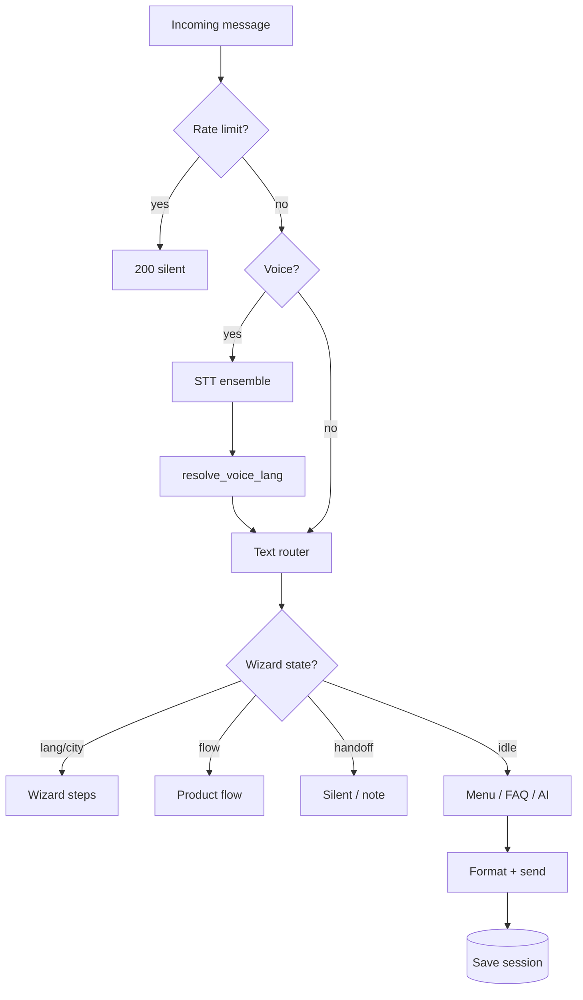

# Гайдбук: AI-чатботы для бизнеса (Telegram / WhatsApp)

**Версия:** 2026-06-15  
**Тип:** универсальный операционный и технический справочник  
**Стек-референс:** Python, FastAPI, Vercel, Supabase, Together/Groq, bilingual kk/ru  

Документ описывает **как проектировать, собирать, деплоить и поддерживать** production-ботов с текстом, голосом, FAQ, LLM и handoff на менеджера. Конкретный продукт (название, офисы, ставки) — настраивается; паттерны — общие.

> **Референс-реализация в этом репозитории:** финансовый бот Komek Damu (`app/bot/`). См. [Приложение F](#f-референс-реализация-komek-damu).

---

## Содержание

1. [Для кого и зачем](#1-для-кого-и-зачем)
2. [Архитектура типового бота](#2-архитектура-типового-бота)
3. [Каналы: Telegram и WhatsApp](#3-каналы-telegram-и-whatsapp)
4. [Карта событий и состояний](#4-карта-событий-и-состояний)
5. [Wizard и сценарии диалога](#5-wizard-и-сценарии-диалога)
6. [Голос (STT): пайплайн и ловушки](#6-голос-stt-пайплайн-и-ловушки)
7. [Двуязычие и детекция языка](#7-двуязычие-и-детекция-языка)
8. [AI: FAQ, гибрид, агент](#8-ai-faq-гибрид-агент)
9. [Матрица моделей](#9-матрица-моделей)
10. [Данные: сессии, лиды, CRM](#10-данные-сессии-лиды-crm)
11. [Хранилища: БД, Blob, корпуса](#11-хранилища-бд-blob-корпуса)
12. [Деплой и окружения](#12-деплой-и-окружения)
13. [Мониторинг и voice debug](#13-мониторинг-и-voice-debug)
14. [Энциклопедия багов](#14-энциклопедия-багов)
15. [Troubleshooting](#15-troubleshooting)
16. [Тестирование](#16-тестирование)
17. [Безопасность](#17-безопасность)
18. [Как масштабировать команду ботов](#18-как-масштабировать-команду-ботов)
19. [Приложения](#19-приложения)

---

## 1. Для кого и зачем

### 1.1 Аудитория

| Роль | Что взять из гайда |
|------|-------------------|
| Разработчик | Архитектура, STT, env, деплой, баги |
| Product / владелец | Сценарии, handoff, язык, UX-правила |
| Поддержка / QA | Чеклисты, smoke-тесты, voice debug |
| Новый человек | Разделы 2–5 без чтения всего кода |

### 1.2 Какие боты покрывает гайд

- B2C консультанты (финансы, услуги, недвижимость, медицина)
- Сбор заявок (лиды) + FAQ
- **Текст + голос** в одном пайплайне
- **Два языка** (шаблон: kk + ru, легко заменить на любую пару)
- Telegram + WhatsApp из одной кодовой базы

### 1.3 Универсальные UX-принципы

| Принцип | Почему |
|---------|--------|
| Один пайплайн для текста и голоса | После STT — те же правила, что для текста |
| Не показывать сырой транскрипт клиенту | Ошибки STT пугают; debug — только оператору |
| Язык по **содержанию** реплики, не по умолчанию API | Иначе русский голос → казахский ответ |
| Правила FAQ **до** LLM | Скорость, предсказуемость, меньше галлюцинаций |
| Handoff с таймаутом | Менеджер отвечает; бот не молчит вечно |
| Plain text телефоны в WA | Markdown/`tel:` ломается в Green API |
| Очистка чужих символов (CJK) | LLM вставляет `电话` и т.п. |

---

## 2. Архитектура типового бота

### 2.1 Рекомендуемые слои

```
Канал (TG / WA / Web)
        │
        ▼
  Webhook API (FastAPI)
        │
        ├── Rate limit + auth
        ├── Session store (DB + memory cache)
        ├── Router (wizard / menu / free text)
        │
        ├── Voice? → STT ensemble → тот же router
        │
        ├── FAQ rules (мгновенно)
        ├── LLM agent (KB-grounded)
        └── FAQ guide (уточняющий вопрос)
        │
        ▼
  Outbound (формат под канал)
        │
        ├── CRM / leads
        └── Manager alert (Telegram ops-чат)
```

### 2.2 Минимальный набор модулей (любой проект)

| Модуль | Ответственность |
|--------|-----------------|
| `config.py` | Env → typed Settings |
| `handlers.py` | Оркестрация (можно дробить позже) |
| `lang_detect` + `lang_policy` | Язык ответа |
| `voice_stt` | Распознавание |
| `voice_router` | Голос → команда/текст |
| `knowledge_base` + `faq_matcher` | Контент без LLM |
| `ai_agent` | LLM с ограничениями |
| `supabase_client` / аналог | Персистентность |
| `formatting` + `outbound` | Адаптация под TG/WA |

### 2.3 Сессия (универсальная модель)

```json
{
  "state": "idle | selecting_lang | selecting_city | in_flow | handoff",
  "lang": "kk | ru | en | ...",
  "lang_locked": false,
  "city": "string | null",
  "city_confirmed": false,
  "product": "string | null",
  "flow_step": "string | null",
  "data": {},
  "handoff_until": 0,
  "conversation_history": [],
  "platform": "telegram | whatsapp",
  "from_voice": false,
  "last_voice_raw": ""
}
```

**Правило:** без внешнего хранилища serverless теряет сессию на cold start.

### 2.4 Где хостить

| Вариант | Плюсы | Минусы |
|---------|-------|--------|
| **Vercel / Cloud Functions** | Быстрый деплой, webhook | Лимит 60s, cold start |
| **VPS + Docker** | Полный контроль, local LLM | DevOps |
| **Fly.io / Railway** | Средний путь | Цена |

Для STT+LLM в одном запросе — укладываться в **timeout функции** или выносить STT в отдельный worker.

---

## 3. Каналы: Telegram и WhatsApp

### 3.1 Telegram

**Обязательно:**

- Webhook + `secret_token` на входящие
- `GET /setup` после каждого смены URL (если lifespan отключён)
- `sendChatAction` вместо «слушаю…» для голоса
- Inline-кнопки + цифры (дублирование навигации)

**Типовые endpoints:**

| Method | Path | Назначение |
|--------|------|------------|
| POST | `/webhook/telegram` | Updates |
| GET | `/setup` | Регистрация webhook |
| GET | `/health` | Мониторинг |

### 3.2 WhatsApp (Green API и аналоги)

**Отличия от Telegram:**

| Аспект | Telegram | WhatsApp |
|--------|----------|----------|
| Кнопки | Inline keyboard | Только цифры в тексте |
| Markdown | Legacy Markdown | Упрощённый `*bold*` |
| Голос | `voice` object | `audioMessage` / file URL |
| Webhook auth | Secret header | Bearer token |

**Паттерн:** после каждого ответа — bilingual hint (`0` назад, `98` город, `99` язык).

### 3.3 Handoff на менеджера (универсально)

1. Триггер: код меню, ключевые слова («оператор», «менеджер»).
2. `state = handoff`, `handoff_until = now + N hours`.
3. Уведомление в **ops-чат** (Telegram): chat_id, история, команда ответа.
4. Выход: слово `бот` / `bot` или таймаут.

---

## 4. Карта событий и состояний

### 4.1 Входящие события (чеклист)

- [ ] Текст
- [ ] Голос / audio
- [ ] Callback (inline)
- [ ] Фото / документ → вежливый отказ + меню
- [ ] Команды `/start`, служебные коды `0` / `98` / `99`
- [ ] Ops-команда `/reply CHAT_ID текст` (только из allowlist chat)

### 4.2 Порядок обработки свободного текста (шаблон)

1. Явная смена языка
2. Навигация (0, 98, 99)
3. Цифра меню / wizard step
4. Intent «общий вопрос без продукта» → FAQ/AI
5. Калькулятор / спец. intent
6. FAQ matcher (rules)
7. LLM agent
8. FAQ guide
9. Fallback

### 4.3 Rate limiting

Рекомендация: 20 сообщений/мин, 100/час на chat_id — защита от флуда и runaway costs.

---

## 5. Wizard и сценарии диалога

### 5.1 Трёхшаговый wizard (шаблон)

```
Шаг 1: Язык (цифра или авто-детект из текста)
Шаг 2: Город / регион / филиал
Шаг 3: Главное меню (N пунктов)
```

Каждый шаг должен принимать **и цифру, и свободный текст** («Алматы», «русский»).

### 5.2 Меню по цифрам

| Паттерн | Описание |
|---------|----------|
| 1…N | Продукты / услуги |
| 0 | Назад |
| 98 | Сменить город/филиал |
| 99 | Сменить язык |
| N+1 | Оператор (handoff) |

### 5.3 Product flow (заявка)

Многошаговый сбор полей с валидацией → summary → `create_lead` → CRM webhook → спасибо пользователю.

**Поля flow хранить в `session.data`**, шаг в `flow_step`.

### 5.4 Расписание «бот vs человек»

Опционально: в рабочие часы менеджера бот молчит (`BOT_SCHEDULE_ENABLED` + timezone).

---

## 6. Голос (STT): пайплайн и ловушки

### 6.1 Рекомендуемый ensemble

```
Audio bytes
    → Parallel: Provider A (kk) + Provider B (kk)
    → Score transcripts
    → If score low: Provider C (specialized model)
    → Optional: LLM refine (только для целевого языка)
    → Normalize + strip garbage
    → Same router as text
```

Провайдеры (любая комбинация): **Together Whisper**, **Groq Whisper**, **HuggingFace**, **local faster-whisper**.

### 6.2 Промпты Whisper

| Длительность | Профиль | Размер |
|--------------|---------|--------|
| < 4 с | compact | ≤ 896 **UTF-8 байт** для Groq |
| 4–15 с | standard | то же |
| 15+ с | rich | до ~2200 символов (Together) |

**Критический баг:** Groq лимит prompt = **896 байт UTF-8**, не символов. Казахский/кириллица ≈ 1.5–2 байта/символ → обрезка обязательна.

### 6.3 Scoring транскрипта

Учитывать: длина, целевые буквы языка, доменные слова, штраф за 1–2 символа.

### 6.4 LLM refine (опционально)

Постправка STT через маленький LLM. **Только если:**

- язык транскрипта = целевой (kk);
- нет утечки промпта в ответ (`Кіріс:`, `STT транскрипт`);
- длина ответа не > 2× исходника.

### 6.5 Маршрутизация после STT

**Не сворачивать длинную фразу (>8 слов) в одну цифру меню** — типичный баг «оператор» / «7» из мусора STT.

Порядок:

1. Нормализация (опечатки домена)
2. Открытый вопрос → raw → AI
3. Короткая фраза → digit / phrase map
4. Intent → digit
5. Опционально: LLM classifier intent (короткие фразы)

### 6.6 Очистка мусора в тексте

`strip_foreign_scripts()` — замена `电话` → `📞`, удаление CJK. Применять в:

- исходящих ответах бота;
- STT normalize;
- LLM refine output.

### 6.7 Таймауты (ориентир)

| Этап | Сек |
|------|-----|
| Скачивание аудио | 20 |
| Полный STT в handler | 55 |
| HF fallback | 18 |
| Vercel function max | 60 |

---

## 7. Двуязычие и детекция языка

### 7.1 Универсальные правила (шаблон kk + ru)

| Ситуация | Язык ответа |
|----------|-------------|
| `lang_locked` | Сохранённый в сессии |
| **≥1 маркер языка A** (буквы, словарь, фразы) | Язык A |
| Явные маркеры языка B, без A | Язык B |
| Сессия уже B, маркеров A нет | Язык B |
| Смесь A+B, есть маркер A | **Приоритет A** |
| Иначе | Default (настраивается) |

### 7.2 Ambiguous words

Слова вроде «кредит», «менеджер», «ипотека» **не должны** определять язык — они общие в жаргоне обоих языков.

### 7.3 Голос vs текст

После STT вызывать `resolve_voice_lang(text, session)` — **не** форсировать default только потому что STT API вернул `kk`.

### 7.4 STT language hint

- Locked ru → STT с `language=ru`
- Иначе → ensemble с приоритетом primary language
- **Не** перезаписывать detected language на default в `_finalize_transcript`

---

## 8. AI: FAQ, гибрид, агент

### 8.1 Три уровня ответа

```
1. FAQ matcher     — regex/keywords, <50ms, бесплатно
2. LLM agent       — KB в system prompt, temperature низкая
3. FAQ guide       — один уточняющий вопрос, не свободный чат
```

### 8.2 Правила system prompt (шаблон)

- Отвечать **только** из базы знаний
- Не выдумывать цифры, ставки, сроки
- Маркер конца `[DONE]`
- Маркер эскалации `[NOTIFY_MANAGER]` при неуверенности
- Язык ответа = язык сессии

### 8.3 Флаги (env)

| Flag | Назначение |
|------|------------|
| `HYBRID_AI` | Включить LLM в общем потоке |
| `FAST_FAQ` | Правила до LLM |
| `FAQ_GUIDE_LLM` | Уточняющий вопрос |
| `STT_LLM_REFINE` | Постправка голоса |

### 8.4 Fallback chain

```
Primary LLM → Secondary provider → Emergency model (Gemini etc.) → Static message
```

---

## 9. Матрица моделей

### 9.1 Production cloud

| Задача | Рекомендация | Альтернатива |
|--------|--------------|--------------|
| Чат быстрый/дёшев | Together Llama 8B Turbo | Groq small |
| Чат качество | Groq large / GPT-class | Together 70B |
| STT multilingual | Ensemble Whisper large | Один провайдер |
| STT узкий язык | Fine-tuned HF model | + ensemble |
| STT post-fix | Same provider small LLM | Off |
| Voice → intent | Rules first | Groq 8B instant JSON |
| Emergency | Gemini Flash | Static fallback |
| FAQ only | **No LLM** | Rules |

### 9.2 Self-hosted (VPS 8GB)

| Задача | Модель |
|--------|--------|
| Chat | qwen2.5:3b (Ollama) |
| STT | faster-whisper small int8 |
| **Не** | 7B+ LLM + medium Whisper на CPU |

### 9.3 Когда менять модель

| Симптом | Действие |
|---------|----------|
| 429 / rate limit | Сменить primary provider |
| Галлюцинации | Усилить FAQ, снизить temperature |
| Медленный голос | Убрать медленный STT из hot path |
| Дорого | FAST_FAQ, короче max_tokens |
| Плохой kk STT | Domain prompt + corpus + refine |

### 9.4 Фреймворки (следующий уровень)

Для **новых** ботов или рефакторинга:

| Инструмент | Когда |
|------------|-------|
| **LangGraph** | Сложный state, audit, handoff |
| **LangSmith** | Трейсы STT/LLM в проде |
| **n8n** | CRM, Bitrix, webhooks без кода в боте |
| **Botpress** | Простой FAQ-бот без кастомного голоса |
| **Pipecat** | Real-time voice **звонки**, не TG voice messages |

Текущий монолит `handlers.py` — нормальная стадия; не переписывать без причины.

---

## 10. Данные: сессии, лиды, CRM

### 10.1 Таблицы (шаблон Supabase/Postgres)

- `clients` — id, platform, name
- `sessions` — chat_id, session_json, updated_at
- `messages` — audit log (cap длины)
- `leads` — заявки из flow

### 10.2 CRM

Webhook POST на Bitrix24 / amo / custom при `flow_complete`. Payload: product, lang, chat_id, collected fields.

### 10.3 Ops-алерт

Telegram-чат менеджеров: новая заявка, handoff, `/reply` proxy.

---

## 11. Хранилища: БД, Blob, корпуса

### 11.1 Зачем Blob для STT

Большие словари/фразы (1–5 MB) не класть в serverless bundle — грузить с Blob/S3 при cold start (с local fallback в repo).

### 11.2 Паттерн loader

```
if BLOB configured → fetch JSON
else → read app/data/local.json
cache @lru_cache
```

### 11.3 Сборка корпуса

1. Download datasets
2. Build vocab JSON (finance words, prompt chunks)
3. Upload to Blob
4. Commit только compact vocab в git

---

## 12. Деплой и окружения

### 12.1 Чеклист env (любой бот)

| Variable | Назначение |
|----------|------------|
| `WEBHOOK_BASE_URL` | Публичный URL |
| `*_BOT_TOKEN` | Канал |
| `*_WEBHOOK_SECRET` | Auth входящих |
| `*_API_KEY` | LLM + STT |
| `DATABASE_URL` / Supabase | Сессии |
| `OPS_ALERT_CHAT_ID` | Менеджеры |
| `VOICE_DEBUG_*` | Тестовый мониторинг |

### 12.2 После деплоя

1. `GET /health`
2. Register webhooks (`/setup`)
3. Smoke: текст + голос
4. Проверить env на проде vs `.env.example`

### 12.3 Git + SSH

Отдельный deploy key на репозиторий → `Host github.com-myproject` в `~/.ssh/config`.

### 12.4 Vercel особенности

- `maxDuration` в `vercel.json`
- Mangum `lifespan="off"` → webhook вручную
- `.vercelignore` для тяжёлых файлов

---

## 13. Мониторинг и voice debug

### 13.1 Паттерн voice debug

На период тестирования:

1. Env: `VOICE_DEBUG_ENABLED`, `VOICE_DEBUG_CHAT_ID`
2. Proxy `TelegramClient` на голосовых
3. `flush()`: forward audio + отчёт (STT, routed, bot reply)
4. **Исключить** chat_id оператора (не слать себе)
5. **Не** мониторить WA пока не реализовано

### 13.2 Что логировать в проде

- `chat_id`, `state`, `lang`, STT score, provider errors
- Не логировать полные API keys

### 13.3 Отключение

`VOICE_DEBUG_ENABLED=false` после стабилизации.

---

## 14. Энциклопедия багов

### 14.1 Голос

| ID | Симптом | Причина | Решение |
|----|---------|---------|---------|
| V1 | Пустой STT | Нет ключей / все провайдеры fail | Проверить env, ensemble |
| V2 | Groq 400 prompt | >896 UTF-8 bytes | `truncate_whisper_prompt` |
| V3 | Неверный язык ответа | Force kk после STT | `resolve_voice_lang` |
| V4 | Меню «7» из длинного голоса | digit extract на мусоре | Лимит слов для digit route |
| V5 | Промпт refine в ответе | LLM leak | Leak markers guard |
| V6 | `电话` в тексте | LLM hallucination | `strip_foreign_scripts` |
| V7 | Timeout 60s | STT+LLM долго | Убрать slow provider |

### 14.2 Webhook / канал

| ID | Симптом | Решение |
|----|---------|---------|
| C1 | TG молчит | `/setup`, secret token |
| C2 | WA 403 Bearer | Sync webhook token |
| C3 | Сессия сброс | Supabase env |

### 14.3 Язык

| ID | Симптом | Решение |
|----|---------|---------|
| L1 | RU → KK ответ | Детект по маркерам, не default |
| L2 | Цикл «выберите язык» | `lang_locked` |

### 14.4 AI

| ID | Симптом | Решение |
|----|---------|---------|
| A1 | Выдуманные факты | FAQ first, strict prompt |
| A2 | 429 | Fallback provider |

---

## 15. Troubleshooting

### 15.1 Бот не отвечает (5 мин)

1. `/health`
2. Webhook registered?
3. Logs platform
4. `handoff` / schedule / rate limit?
5. Текстом — работает?

### 15.2 Голос не работает

1. Текстом тот же смысл?
2. Keys STT configured?
3. Voice debug с **другого** аккаунта
4. Logs: STT result line
5. Локальный тест STT script

### 15.3 После релиза регресс

1. `git diff` env-related
2. `pytest`
3. Smoke checklist (раздел 16)

---

## 16. Тестирование

### 16.1 Автотесты (минимум)

- `lang_detect`, `lang_policy`
- `voice_router` (digits, long utterance)
- `voice_stt` scoring
- `faq_matcher` top intents
- `strip_foreign_scripts`
- `voice_debug` monitor

```bash
pytest -v --tb=short
```

### 16.2 Smoke после релиза

| # | Тест | OK? |
|---|------|-----|
| 1 | /start → wizard | |
| 2 | Смена языка | |
| 3 | Меню цифра | |
| 4 | Текст primary lang | |
| 5 | Текст secondary lang | |
| 6 | Голос primary | |
| 7 | Голос secondary (без маркеров primary) | |
| 8 | Handoff + возврат | |
| 9 | WA аналог (если есть) | |

---

## 17. Безопасность

- Секреты только в env / secret manager
- Ротация при утечке в чат
- `/debug/*`, `/admin/*` — закрыть на prod
- Service role DB — только server-side
- Не коммитить `.env`, ключи, `deploy_key`

---

## 18. Как масштабировать команду ботов

### 18.1 Шаблон нового бота

1. Fork / copy `bot-template` структуру модулей
2. Заменить `knowledge_base`, `content`, `menu`
3. Настроить env, wizard steps, города
4. Оставить **тот же** voice/lang/outbound слой

### 18.2 Что переиспользовать 1:1

- `voice_stt.py`, `stt_prompt_utils.py`
- `lang_detect.py`, `lang_policy.py`
- `voice_debug.py`
- `formatting.strip_foreign_scripts`
- Deploy scripts pattern

### 18.3 Что кастомизировать

- `knowledge_base`, `flows`, `menu`
- Промпты, офисы, продукты
- Корпус STT под домен

### 18.4 Roadmap зрелости

| Стадия | Фокус |
|--------|-------|
| MVP | FAQ + меню + один канал |
| v1 | Второй канал + голос + DB |
| v2 | Voice debug off, LangSmith, CRM |
| v3 | LangGraph / отдельный STT service |

---

## 19. Приложения

### A. Шаблон `.env.example` (имена)

```
WEBHOOK_BASE_URL=
TELEGRAM_BOT_TOKEN=
TELEGRAM_WEBHOOK_SECRET=
TELEGRAM_ALERT_CHAT_ID=
GREEN_API_*=
AI_PROVIDER=together|groq|local
GROQ_API_KEY=
TOGETHER_API_KEY=
VOICE_STT_PROVIDER=ensemble
STT_LLM_REFINE=true
HYBRID_AI=true
FAST_FAQ=true
SUPABASE_URL=
SUPABASE_SERVICE_ROLE_KEY=
BLOB_READ_WRITE_TOKEN=
VOICE_DEBUG_ENABLED=false
VOICE_DEBUG_CHAT_ID=
BOT_SCHEDULE_ENABLED=false
```

### B. Навигационные коды (шаблон)

| Код | Действие |
|-----|----------|
| 0 | Назад |
| 1…N | Пункты меню |
| 98 | Сменить локацию |
| 99 | Сменить язык |

### C. Полезные команды

```bash
curl $WEBHOOK_BASE_URL/health
curl $WEBHOOK_BASE_URL/setup
pytest tests/test_lang_policy.py tests/test_voice_stt.py -v
vercel deploy --prod --yes
```

### D. Mermaid: полный поток



### E. Версионирование гайда

При изменении паттернов в коде — обновлять этот файл и дату в шапке. Продукт-специфичные детали — только в приложении F.

### F. Референс-реализация: Komek Damu

Этот репозиторий (`komek-damu-bot`) — **пример** применения гайда:

| Элемент | Значение в референсе |
|---------|---------------------|
| Домен | Микрофинансы KZ |
| Языки | kk (default) + ru |
| Каналы | Telegram + Green API WA |
| Prod URL | https://komek-damu-bot.vercel.app |
| GitHub | murdasoft/komekdamubot |
| Города | Алматы, Астана, Шымкент, Актау |
| Меню | 1–7: ИП, ТОО, физлицо, ипотека, DAMU, рефинанс, менеджер |
| Voice debug chat | `5450018125` (env `VOICE_DEBUG_CHAT_ID`) |
| Blob store | `store_OTuiNVlUkxdaNaAx` |

Файлы для изучения:

- `app/bot/handlers.py` — оркестрация
- `app/bot/voice_stt.py` — ensemble
- `app/bot/lang_policy.py` — kk/ru
- `docs/LOCAL_MODELS.md` — VPS
- `.env.example` — полный список переменных

**Важно:** бизнес-правила Komek (ипотека только офис, DAMU 12,6%) — **не** универсальны; переносите паттерн, не копируйте контент.

---

*Универсальный гайдбук. Продуктовые детали — в базе знаний конкретного бота.*
